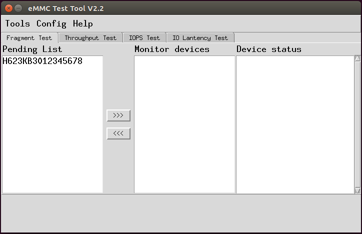
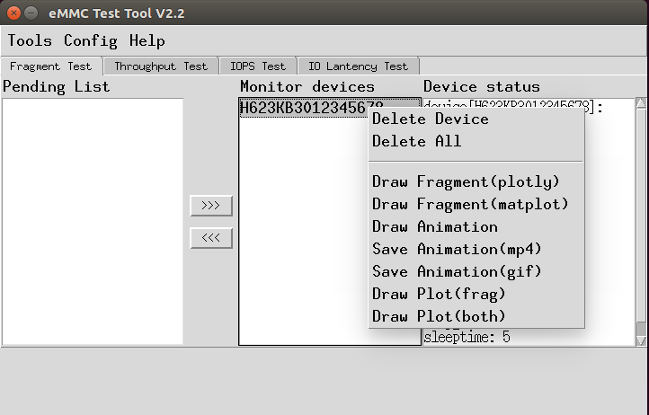
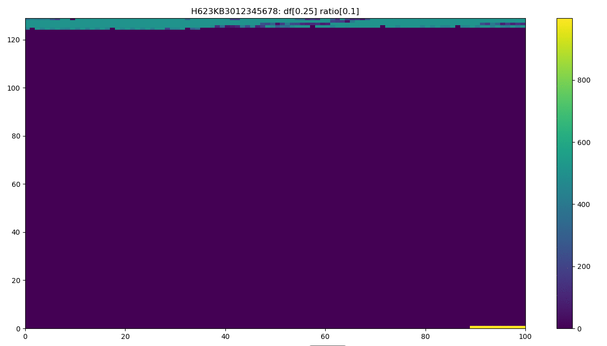
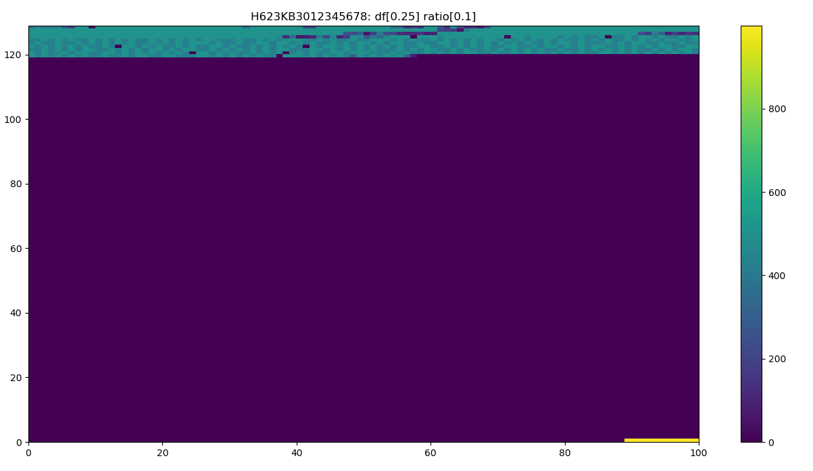
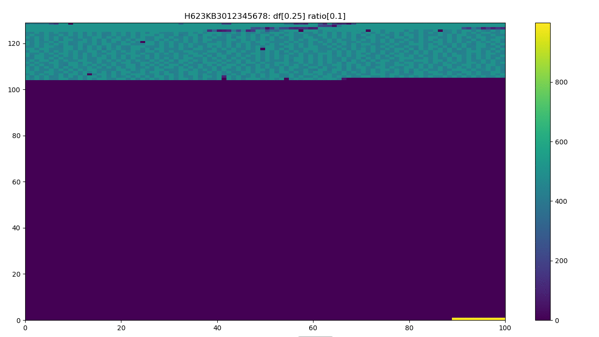
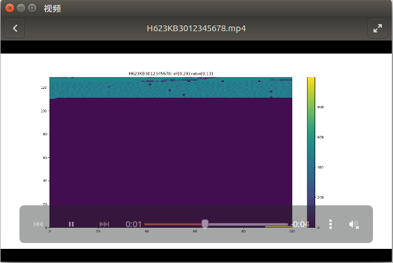
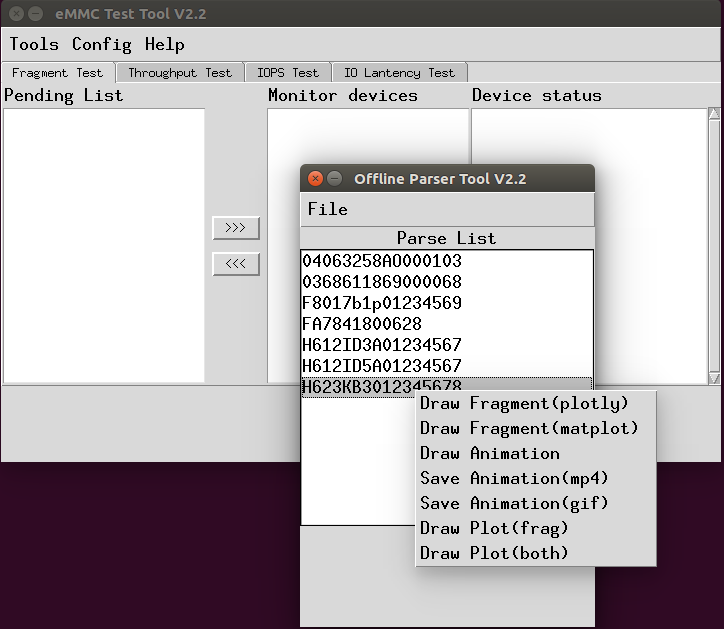

## 1. 界面说明
碎片测试tool，运行后界面如图所示：



主界面分成3个部分，待测设备列表，测试设备列表，设备状态区

设备状态说明：

* df表示当前选中设备的磁盘空间
* frag表示当前选中设备的碎片率
* stime表示设备测试开始时间
* write表示当前是否开启write线程
* detele表示当前是否开启delete线程

配置说明：

* write threads表示配置的写线程数
* write delay表示每个写线程之间的时延
* del threads表示配置的删除线程数
* delete delay表示每个删线程之间的时延
* monitor delay表示设备状态的监控间隔，以及设备的状态数据多久存储一次
* detetc delay表示多久更新设备的在线状态
* Stop WR表示磁盘空间占比多少时写线程停止
* Stop Del表示磁盘空间占比多少时删除线程停止
* Path和Dir表示文件操作的路径


## 2. 操作说明
* 将待测设备列表中的设备选中，并点击按钮>>>添加到测试列表区开始测试
* 如果要更新参数，需要将设备从测试列表移到待测试列表，然后再点击update按钮更新参数
* 从设备的状态区可以每10秒看到更新的设备状态

## 3. 功能展示
测试工具在设备测试过程中可以随时查看设备的状态，并提供多种展现形式，可以保存为影片，动图，曲线等形式  



下面是截取动图的展示效果:





影片形式展示：




测试工具还提供offline数据展示:



## 4. 环境配置
eMMC Test Tool可以运行于Ubuntu和Windows上,需要安装Python 3.6和相关python模块，采用pip安装较为方便，下面是具体的安装步骤：

* sudo add-apt-repository ppa:jonathonf/python-3.6 
* sudo apt-get update 
* sudo apt-get install python3.6
* sudo apt-get install python3-pip
* pip install dash
* pip install dash_renderer
* pip install dash_core_components
* pip install dash_html_components
* pip install pandas_datareader
* pip install flexx
* pip install pandas
* pip install plotly

安装ffmpeg
```
./configure --enable-gpl --enable-libx264
make
sudo make install
```

运行
```
python ToolV2.pyc
```