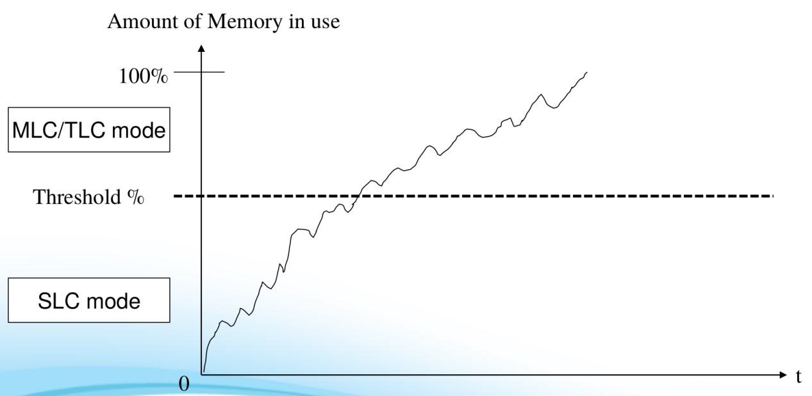
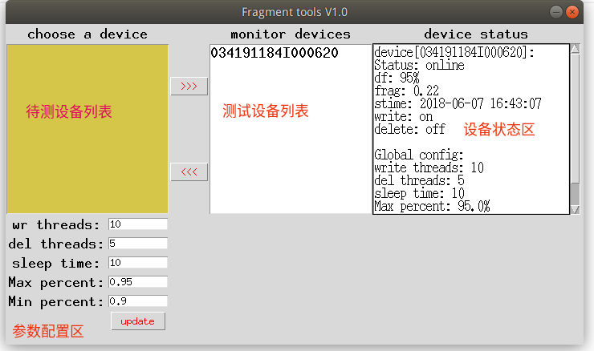

% eMMC性能验证方案V1.1
% Wisen Wang
% May 30, 2018

# 前言

对于eMMC的软件测试

# 1. 填充测试
## 1.1 目的
验证eMMC的Dynamic SLC特性，抓取Dynamic SLC速率曲线，横向对比不同物料在相同填充率下的IO速率变化，纵向对比同一物料在不
同填充率下的IO速率变化。

## 1.2 原理




Dynamic SLC是目前主流的一种提升emmc读写速度的技术，其本质是在eMMC拥有一定量的freeblocks的时候以SLC的mode来writing data。它的速度会随着eMMC的剩余容量而变化，基本原理曲线如上图所示。


## 1.3 前置条件
不同厂家不同产品对Threshold的定义不一样，需要与厂家沟通给出这个值。

## 1.4 测试用例
* Case1：如果从vendor能拿到这个threshold，直接填充到临界点，验证eMMC IO的下降是否满足标准。
* Case2：如果vendor不愿意给出这个threshold，测试需要设计不同的填充率（75%,80%,90%,95%）测试eMMC IO下降数据，并判断是否满足标准。

## 1.5 验收标准
从3个角度来衡量物料的是否可以通过性能验证：

* IO下降是否match物料的spec定义。
* 测试从用户角度出发，在threshold下的io速度是否可被用户接受，从产品定位角度，对不同的产品提出性能要求。
* 横向对比竞品物料在相同填充条件下的IO速率。

## 1.6 测试工具
* Filldata.apk 用于数据填充
* Androbench_V5.1.apk 用于性能测试

# 2. 碎片测试
## 2.1 目的
检验系统碎片对IO速度的影响程度，横向对比不同物料在相同碎片条件下的IO速率，纵向对比同一物料在不同碎片条件下的IO变化规律
，为研发评估IO性能以及制定性能优化策略提供参考数据。

## 2.2 背景
目前业界对于文件系统碎片的处理主要有以下几点：

### 2.2.1 文件系统的GC逻辑

F2FS文件系统有自己的GC线程，它的处理逻辑依赖当前系统的状态，目前F2FS的GC线程触发的条件：

* IO子系统处于idle状态
* 一定阈值的脏segments

### 2.2.2 上层清理策略

一般手机厂家都会定制一些上层的清理策略，这些策略的基本逻辑可以分为2种：

* 面向时机清理（Idle清理，灭屏清理，夜间充电清理等）
* 面向类型清理（安装文件清理，应用缓存文件清理，其它垃圾文件清理等）

在这样的背景下，碎片测试可以为我们制定GC条件和清理策略提供数据支撑。

## 2.3 难点
目前业界对于文件系统碎片的描述没有一个量化的指标，我们无法通过一个具体的量化的数值来反映系统的碎片状况。所以对于碎片下
的IO性能的评估的前提就是要建立一个对碎片状态的量化的描述模型。

## 2.4 现状与计划
目前性能组正尝试建立一个量化模型，通过这个量化指标来直观的反映系统碎片状况。同时另外一种碎片的表现形式即文件系统碎片可
视化工具也在计划中。

因此针对碎片测试，安排计划如下：

1. 文件系统碎片状态可视化工具开发，直观反映系统碎片状态（PC版）(done)
2. 定义文件系统碎片量化指标模型并验证(50%)
3. 文件系统碎片工具开发与测试case制定(50%)


# 3. 测试工具SOP
## 3.1 界面说明
碎片测试tool，运行后界面如图所示：



主界面分成4个部分，待测设备列表，测试设备列表，设备状态区，参数配置区

设备状态说明：

* df表示当前选中设备的磁盘空间
* frag表示当前选中设备的碎片率
* stime表示设备测试开始时间
* write表示当前是否开启write线程
* detele表示当前是否开启delete线程

配置说明：

* write threads表示配置的写线程数
* write delay表示每个写线程之间的时延
* del threads表示配置的删除线程数
* delete delay表示每个删线程之间的时延
* monitor delay表示设备状态的监控间隔，以及设备的状态数据多久存储一次
* detetc delay表示多久更新设备的在线状态
* Stop WR表示磁盘空间占比多少时写线程停止
* Stop Del表示磁盘空间占比多少时删除线程停止
* Path和Dir表示文件操作的路径

## 3.2 操作说明

* 将待测设备列表中的设备选中，并点击按钮>>>添加到测试列表区开始测试
* 如果要更新参数，需要将设备从测试列表移到待测试列表，然后再点击update按钮更新参数
* 从设备的状态区可以每10秒看到更新的设备状态

## 3.3 运行环境配置
Fragment tools V1.0运行于Ubuntu 16.04,需要安装Python 3.6和相关python模块，采用pip安装较为方便，下面是具体的安装步骤：

* sudo add-apt-repository ppa:jonathonf/python-3.6 
* sudo apt-get update 
* sudo apt-get install python3.6
* sudo apt-get install python3-pip
* pip install dash
* pip install dash_renderer
* pip install dash_core_components
* pip install dash_html_components
* pip install pandas_datareader
* pip install flexx
* pip install pandas
* pip install plotly

### 3.3.1 安装ffmpeg
./configure --enable-gpl --enable-libx264
make
sudo make install

## 3.4 运行tool
```
./emmc_test
```